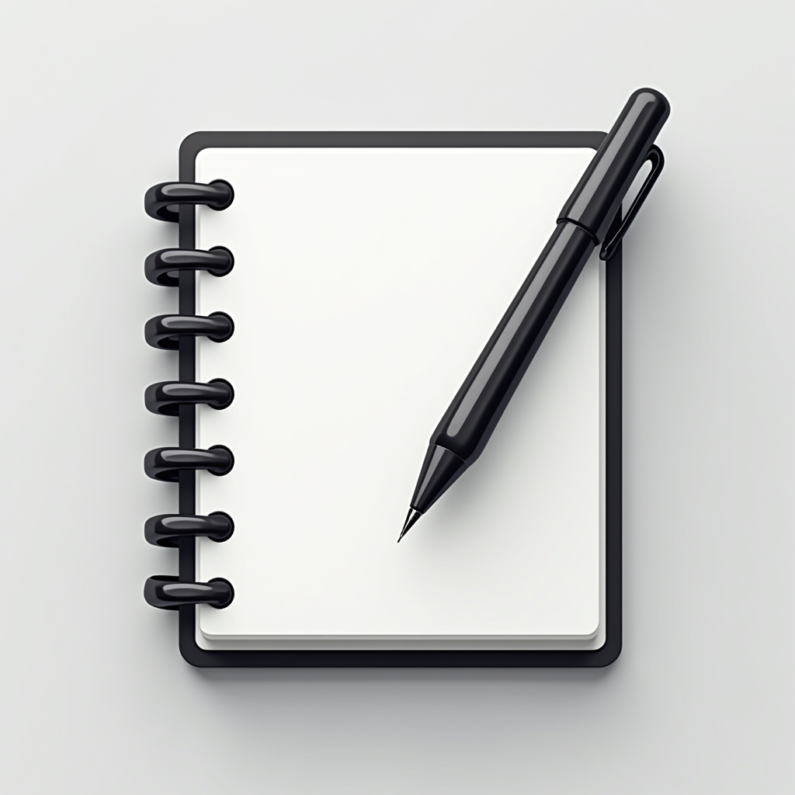

# MindMate: AI Дневник состояния

  

  <strong> MindMate </strong> 

<h2> Демо </h2>

<h2> Продукт </h2>

Приложение, в котором пользователь описывает свой день или эмоции, а локальная LLM не просто генерерует "отзыв", но и советует конкретные действия, которые могут помочь улучшить ментальное состояние пользователя.

Пользователи могут легко и быстро сохранять заметки о своём состоянии и получать рекомендации, не передавая чувствительные данные внешним сервисам. Интуитивно понятный пользовательский интерфейс также позволяет просматривать старые заметки.

<h2> Фичи </h2>

- [x] Получение рекомендаций от ИИ: эмо-анализ, генерация советов

- [x] Локальное сохранение заметок

- [x] Работа с чеклистом полученным от ИИ: трекинг прогресса

- [x] Просмотр истории заметок
